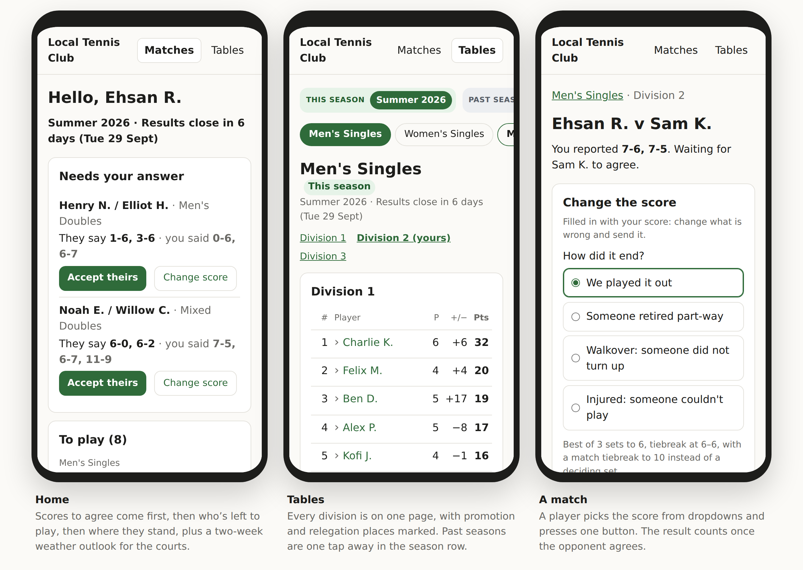

# DeuceLeague

Open-source club tennis league software: the database and the API. Everything
people see — websites, phone apps, Telegram bots — is built on top by whoever
wants it, and they keep whatever they put on it.

**Status:** the data model, the API and a reference website are built, and
verified against a real Postgres by `npm run db:verify`. A club runs its own
instance by following [docs/SELF-HOSTING.md](docs/SELF-HOSTING.md).

**For coaches:** [See what DeuceLeague looks like and how a coach can use it](https://emrahman.github.io/DeuceLeague/for-coaches.html).

[](https://emrahman.github.io/DeuceLeague/for-coaches.html)

## What is here

```
packages/schema   Zod schemas: scores, match formats, league rules      MIT
packages/engine   League logic: standings, fixtures, promotion          AGPL
packages/db       Postgres schema, migrations and queries (Drizzle)     AGPL
packages/api      The HTTP API (Hono), with its OpenAPI spec            AGPL
adapters/website  The reference website: player sign-in and scores      MIT
docs/DATA-MODEL.md  How the model works and why it is shaped this way
docs/API.md         What the API offers, who can call it, and why
docs/SELF-HOSTING.md  Running it for a club: server, HTTPS, email, backups
docs/COACH-WORKFLOW.md Running a season through a coding agent, in plain language
docs/SCHEMA.md      Generated column-by-column reference for every table,
                    view and function
```

## Getting started

```bash
npm install
npm test            # score validation
npm run db:verify   # migrations, constraints, RLS, the API and the website against a real Postgres (needs Docker)
```

To try the whole thing — Postgres, the API and the website — with Docker:

```bash
cp .env.example .env
docker compose up -d --build     # migrates, then starts the API on :3000 and the website on :8080
docker compose run --rm api node packages/api/dist/cli/club-create.js --slug my-club --name "My Tennis Club"
```

To work on the code, run only the database in Docker and the rest from source:

```bash
docker compose up -d postgres
npm run db:migrate    # as the table owner; the app itself connects as deuceleague_app
npm run club:create -- --slug my-club --name "My Tennis Club"   # prints your first API key
npm run demo:seed                   # or: two fake clubs to explore, into an empty database
npm run api           # http://localhost:3000 — the spec is at /openapi.json
npm run website       # http://localhost:8080 — needs WEBSITE_API_KEY; see docs/SELF-HOSTING.md
```

For a club's real instance — a server, HTTPS, email and backups — follow
[docs/SELF-HOSTING.md](docs/SELF-HOSTING.md).

## The model in one screen

A **season** is a competitive period the club defines — most run four a year,
with dates the coach picks. Inside it sit **competitions**: Men's Singles,
Women's Doubles, Mixed Doubles. Each competition has **divisions**, and each
division holds **entries** — one member for singles, two for doubles. Entries
play **matches**, and a match with no score yet is simply a fixture.

Standings are computed from matches on read, never stored. A score enters the
ledger only when both sides agree — either by reporting the same score
independently, or by one accepting the other's — never on a timer. Promotion and relegation are suggested to the coach and applied
only when they confirm.

Read [docs/DATA-MODEL.md](docs/DATA-MODEL.md) for the reasoning.

## Design commitments

**The core renders nothing.** It emits JSON and knows nothing about HTML,
Telegram or email. The reference player site stays focused on league tasks.
A coach may add club notices or sponsor acknowledgements to their own adapter,
but decides whether they appear and keeps control of their placement.

**League rules are data, not code.** Points per outcome, tiebreak ordering,
promotion counts, how withdrawals and deadlines are handled — all JSON on the
competition. Changing how a club's league works should never require a release.

**The coach decides.** The engine advises on placements; it never applies them.
Coaches hold information the data does not.

**League actions come first.** The reference website leads with scores that
need an answer and matches still to play. It reserves no space for adverts.
Club notices, lesson links or sponsor acknowledgements appear only if the coach
chooses to add them, and never ahead of a player's league tasks.

**No scheduling, and nothing gets sent.** There is no calendar and no reminder
system. The core answers *who still has matches outstanding and how long is
left*; whether an email goes out, and what it says, is the coach's call. See
[docs/DATA-MODEL.md § No scheduling](docs/DATA-MODEL.md#no-scheduling-and-why).

**Small enough to read.** Thirteen tables. If the core outgrows that, the new
thing belongs in an adapter.

## Licence

`packages/schema` and the reference website in `adapters/website` are MIT —
build anything on them, and keep what you build. The server is
AGPL-3.0-or-later.
