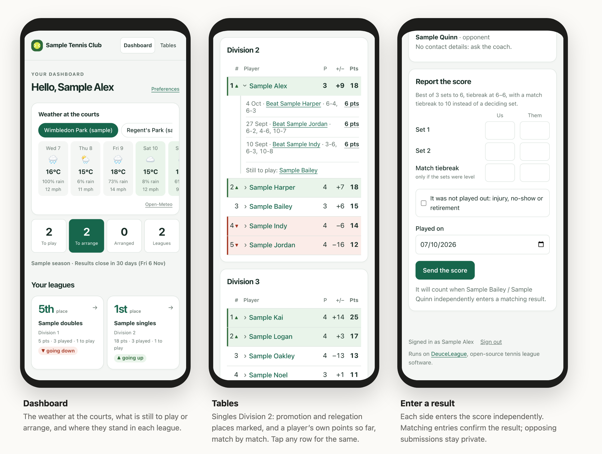
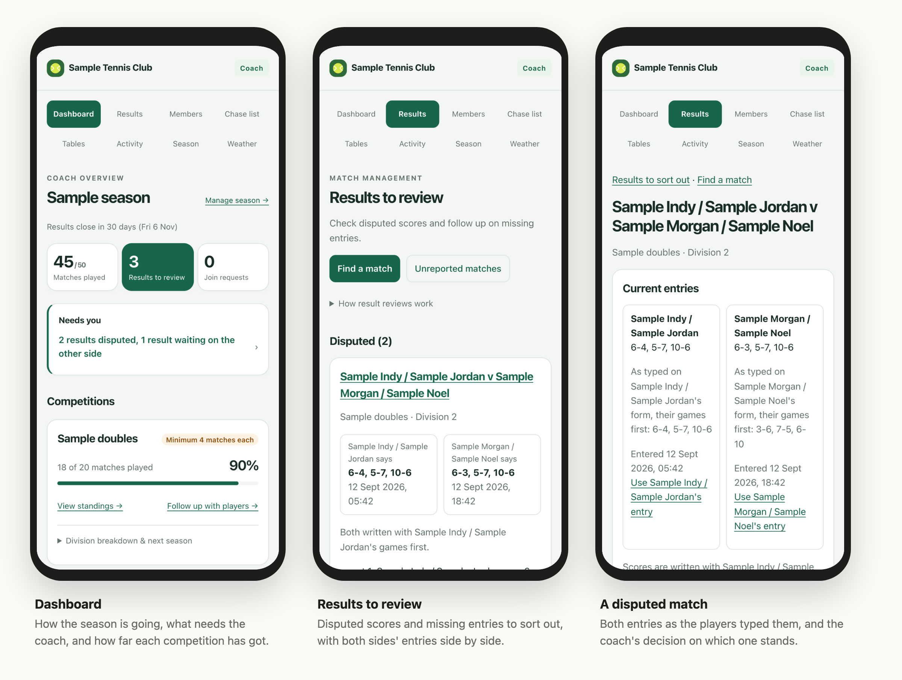

# DeuceLeague

Free, open-source tennis league software for a club. Players enter their
results and check the tables from their phones: a website, so no app to
install, no passwords and no adverts built in. Both sides enter the score
independently; matching entries confirm it, and opposing submissions stay
private. The coach runs the league from their phone too, with a coding agent
such as Claude Code, Codex or Pi Agent for the bigger jobs. It runs on
Cloudflare's free plan, in the club's own account.

A club player built it to see what AI-era tools could do for a club league. It
aims at better tennis and more competitive matches, not traffic or adverts.

**[For coaches →](https://emrahman.github.io/DeuceLeague/)** what it does, how to run your club, and how it fits
together.

## Try it

Deploy it with a sample club in mid-season, then play it as the coach and as
two players. It takes about fifteen minutes in your browser, with no email
service and no server.

[](deploy/cloudflare/TRY.md)

## What it looks like

**Players**, on their phones: their dashboard, the tables, and entering a result.



**The coach**, on theirs: the dashboard, results to review, and a disputed match.



## In beta

Six simulated clubs have been run through their seasons, between 30 September
and 7 October 2026. The largest was a 150-member club over two seasons, where
all 191 independently checked standings rows matched, and each run shaped the
next round of work. Automated tests pass. It hasn't yet run a season at a real
club, so it's in beta: we're looking for a coach willing to pilot it with their
players. [What the simulations found, and next work](https://emrahman.github.io/DeuceLeague/#where-it-stands).

## For coaches

- **Free for your players, and nothing in their way.** Entering a result,
  the tables and who's left to play are a tap or two from the home page.
- **The club owns it.** Your own Cloudflare account, your own database, often
  at no cost.
- **You stay in charge.** It suggests promotions and relegations but never
  makes them, and it never messages anyone on its own.
- **Make it yours.** Add your coaching, lesson bookings or a club bot around
  the league, without touching its data.

The [guides to running your club](https://emrahman.github.io/DeuceLeague/#run-your-club) cover starting a club for
real, running it day to day, making the site your own and taking updates.

## For players who'd like to help

If you play in a league and have some spare time, there's useful work here.
[Fork the project](https://github.com/EMRahman/DeuceLeague/fork), pick an item
from the [next work](https://emrahman.github.io/DeuceLeague/#where-it-stands), and follow the
[development guide](DEVELOPING.md) to run the checks. The league is an API, so
a bot, an app or a report can be built on it too: see the
[API reference](https://emrahman.github.io/DeuceLeague/api.html) and [how it's built](https://emrahman.github.io/DeuceLeague/#build-on-it).

```
packages/schema   Shared Zod schemas for scores, formats, and rules       MIT
packages/engine   Fixtures, standings, result decisions, and placements   AGPL
packages/db-d1    D1 schema, migrations, and persistence                  AGPL
packages/api      HTTP API and OpenAPI contract                            AGPL
adapters/website  Reference player website                                 MIT
adapters/coach    Coach's website: progress, results, chase list, links   MIT
deploy/cloudflare Worker deployment, installer, and recovery tooling
docs/API.md       API concepts, permissions, and workflows
```

## Licence

`packages/schema`, `adapters/website` and `adapters/coach` are MIT. The
server-side packages are AGPL-3.0-or-later.
