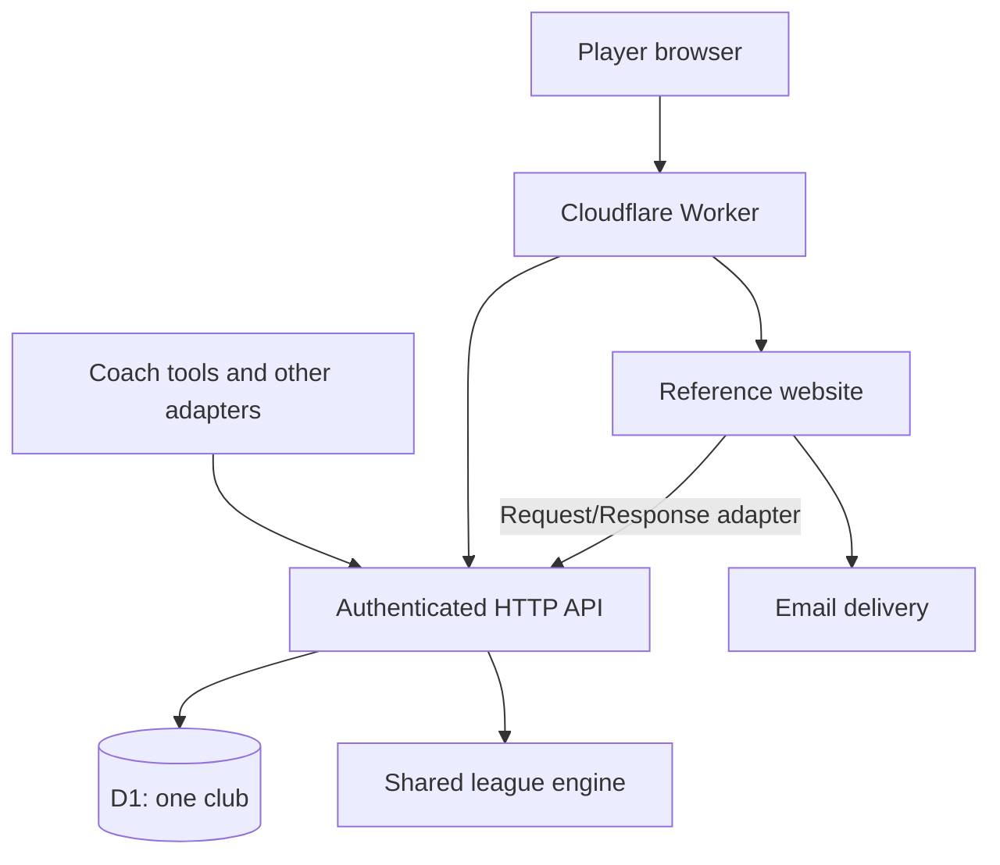

# Cloudflare migration plan

Updated: 27 September 2026. Status: PostgreSQL baseline and local D1 feasibility
verified. D1 setup, identity, results, club/member administration, league setup,
fixtures, entry opt-outs, standings and progress/chase reads pass local tests,
including a 17-division club with 933 fixtures. Atomic placements now carry its
186 entries into next-season drafts. Event-feed pagination and imported PostgreSQL
cursors pass too. All 49 API operations (including health) match the saved
contract. The combined Worker website now passes local login, scoring, email,
persistent cooldown and weather-cache tests. The protected installer now
registers the website key atomically and handles interrupted responses with a
saved admin key. The optional sample preset commits atomically with setup, and
its owner sign-in journey passes locally with intercepted email. Account-owner
administrator recovery now passes a local CLI rehearsal. The deploy-button
template and migration/deploy command pass a clean Node 22 rehearsal. The
`cloudflare-preview` branch is published with [draft PR #8](https://github.com/EMRahman/DeuceLeague/pull/8);
the owner's remote acceptance is the next gate. See the
[stage 1 baseline](migrations/STAGE-1.md),
[stage 1C results checkpoint](migrations/STAGE-1C.md),
[stage 2A administration checkpoint](migrations/STAGE-2A.md) and
[stage 2B league setup checkpoint](migrations/STAGE-2B.md) and
[stage 2C1 computed reads checkpoint](migrations/STAGE-2C1.md) and
[stage 2C2 placements checkpoint](migrations/STAGE-2C2.md) and
[stage 2D event-feed checkpoint](migrations/STAGE-2D.md) and
[stage 3A website checkpoint](migrations/STAGE-3A.md) and
[stage 3B1 installer checkpoint](migrations/STAGE-3B1.md) and
[stage 3B2 sample checkpoint](migrations/STAGE-3B2.md) and
[stage 3B3 recovery checkpoint](migrations/STAGE-3B3.md) and
[stage 4A deployment checkpoint](migrations/STAGE-4A.md).

## Outcome and scope

Make DeuceLeague installable into a club's own Cloudflare account through a
**Deploy to Cloudflare** button. The first acceptance milestone is the project
owner using that button in their existing account, completing setup, and
running a sample league through the player website and API.

The proposed destination is one Worker serving the existing API and reference
website, one D1 database per club deployment, and email delivery from the
website adapter. Keep the API available for coaches, bots, and other adapters.
Keep the league rules and public behaviour; change persistence and hosting.

Maintain one backend after migration. Preserve the last verified PostgreSQL
release with a tag and its operating instructions. Keep PostgreSQL available
during development for comparison and rollback, but do not build a permanent
database abstraction with two supported implementations. Its eventual removal
from the main development path follows successful acceptance, not the first
working D1 prototype.

This plan does not assume there is a live club database to move. The first
account trial uses fake data. A real-data cutover is a separate final stage if
needed. The public deploy button now targets the preview branch through the
[account-trial guide](../deploy/cloudflare/TRIAL.md); its real account flow
still needs acceptance before it becomes the default installation path.

## Architecture

Add a deployment composition package, provisionally `deploy/cloudflare`, that
imports and connects the API and website factories. Keep the website's existing
`apiClient` transport: inject a fetch implementation that dispatches a Request
to the API's fetch handler, including its normal credentials and middleware.
Avoid an external request back to the Worker's own hostname. The website must
not import database, engine, or API internals; composition belongs outside it.

Build one Worker from the repository root so all workspace dependencies are
available. Retain the package licence boundaries and source notices. This
matches the deploy button's single-Worker model; Cloudflare documents limits
on deploying multiple applications from a monorepo. D1 provisioning and a
custom migration/deploy script are supported by the button. Prove the exact
repository layout in phase 1. [Deploy-button documentation][deploy]

Use D1 as the source of truth for league data, sessions, and audit history.
Do not add KV, Queues, R2, or Durable Objects unless a demonstrated requirement
needs them. Start without D1 read replication; immediate result visibility is
part of the acceptance tests.

## Behaviour that must survive

- Compute standings from the accepted match ledger on every read.
- Keep entries and match sides shared between singles and doubles.
- Confirm a result only through agreement or an explicit coach settlement;
  retain disputes, replacement claims, and the coach override requirement.
- Keep deadlines in the club's timezone, including daylight-saving boundaries.
- Keep promotion as a suggestion and preserve next-season opt-outs.
- Require credentials for every league API endpoint. Preserve scope checks,
  competition visibility, player-side restrictions, and PII filtering.
- Preserve token hashing, one-time login links, session revocation, and
  existing session lifetime semantics.
- Commit each successful mutation and its audit events together. Failed
  operations must leave neither partial changes nor misleading events.
- Keep events append-only and pagination lossless under concurrent activity.
- Keep email in the website adapter. Add no reminders, scheduling, or adverts.

These are behavioural requirements from [DATA-MODEL.md](DATA-MODEL.md),
[API.md](API.md), and [CLAUDE.md](../CLAUDE.md). Their PostgreSQL-specific
mechanisms must be replaced and documented, rather than silently removed.

## Database and API changes

| Existing mechanism | Planned replacement |
|---|---|
| Drizzle PostgreSQL schema and migrations | Drizzle SQLite/D1 schema and a fresh D1 migration history; preserve checks, indexes, and composite foreign keys |
| UUID, timestamptz, date, JSONB, text arrays | UUIDv7 text IDs, consistently encoded UTC instants, date-only strings, validated JSON text, and JSON or relational scope storage |
| RLS and `SET LOCAL app.club_id` | One club per database, explicit authenticated club context in queries, and database constraints preventing a second club or cross-club references |
| `SECURITY DEFINER` credential resolvers | Bound, narrowly scoped credential lookups with equivalent expiry, revocation, and member-status checks |
| Request-wide transaction middleware | Explicit atomic domain operations; handlers validate authorization before committing changes |
| `SELECT ... FOR UPDATE` | Guarded atomic mutations with conflict detection and bounded retries, proven in phase 1 |
| PostgreSQL views and date functions | SQLite views/queries or API-side calculations with equivalent timezone and PII behaviour |
| PostgreSQL constraint names/SQLSTATE | D1 error translation retaining documented API status codes and problem codes |
| Transaction IDs and snapshot-aware event feed | Commit-safe sequence allocated within atomic mutations, with legacy cursor compatibility for imports |
| PostgreSQL schema comments and generated docs | Schema metadata/comments suitable for SQLite, with a replacement documentation generator/check |

Keep `/v1` methods, request/response shapes, scopes, errors, and the OpenAPI
contract stable. Check compatibility with captured baseline responses and
existing tests; any unavoidable break must be explicit and versioned rather
than hidden behind the same endpoint.

### Atomicity is the first feasibility gate

The current `packages/api/src/middleware.ts` wraps the entire request in a
PostgreSQL transaction, and `packages/db/src/matches.ts` locks result rows.
D1's atomic `batch()` executes a prepared sequence of statements; it does not
directly replace a callback that alternates database reads with TypeScript
decisions. [D1 database API][batch]

Prototype complete domain operations before porting all queries:

1. Read the state needed by the pure engine and compute the proposed change.
   The first implementation reads all inputs and a club-wide revision in one
   D1 batch; every participating mutation advances that revision.
2. Submit all dependent writes and events in one atomic batch, guarded by
   versions or equivalent SQL predicates covering every relevant precondition.
3. Detect stale state, re-read, and retry within a bounded policy. A guard that
   affects zero rows must not allow later statements to write an event or
   partial result: prove all-or-nothing behaviour, not just successful SQL.
4. Include concurrent changes to deadlines, visibility, membership, and
   credentials in the precondition analysis, not only changes to the match.
5. Return success only once the operation has committed. Exercise retries and
   ambiguous network failures so they cannot duplicate logical mutations.

The first cases are simultaneous result reports, consuming a login link while
creating its session, and creating fixtures with their sides. Also cover
concurrent revocation of the last administrator and competing entry changes.
Do not use an in-memory mutex: multiple Worker instances would bypass it.

If D1 cannot meet these guarantees with understandable code, record the failed
case and revise this architecture before continuing. Evaluate a transactional
SQLite Durable Object at that point; do not accumulate a second datastore and
coordination layer just to preserve the original plan.

D1 currently limits queries to 100 bound parameters each. Existing bulk
fixture inserts need smaller statements within the atomic operation. Respect
the batch duration and invocation limits too; splitting statements must not
turn one user action into partially committed chunks. [D1 limits][limits]

### Club isolation and event compatibility

Each deployment owns one club. Enforce that in schema/bootstrap and reject
credentials whose club does not match the installation. Retain `club_id` and
composite relationship checks; caller-supplied IDs never establish authority.
Test two independent deployments with each other's IDs and tokens. Import a
multi-club PostgreSQL database by explicitly selecting one club per target.

For events, preserve the existing `<number>.<number>` cursor shape and event
IDs for imported history. Design the D1 sequence so all post-import positions
sort after the frozen source's final position, with sequence allocation and
events committed together. Prove resuming from a saved PostgreSQL cursor
returns every remaining event exactly once. A migration must not quietly reset
consumers or discard audit history. Treat sequences as lossless integer strings
at the API boundary.

Implemented locally in stage 2D: immutable padded-decimal cursor mappings,
atomic insertion-trigger allocation, and an empty-history import primitive
that puts native positions above the frozen PostgreSQL watermark. Full export,
source-freeze verification, entity import and cutover tooling remain pending;
see the [event-feed checkpoint](migrations/STAGE-2D.md) for the exact boundary.

## Deploy button and first-run setup

The club-facing flow should be: **Deploy → configure the club → test email →
open the league**. The application, database creation, and schema migration
must not require local Docker, PostgreSQL, or a terminal.

Provide root Wrangler configuration, reproducible build/deploy scripts, a
committed lockfile, and example configuration containing no real credentials.
The button must provision a fresh D1 database without a database ID from the
maintainer's account. Run migrations by binding name. Confirm behaviour when
the installer changes the Worker, repository, and database names. [Deploy-button documentation][deploy]

The installer needs Cloudflare and GitHub/GitLab access. The supported initial
target is Workers Paid. Existing Cloudflare-account ownership does not establish
that a paid plan or outbound email is already enabled.

Build a small setup wizard, not a new general-purpose coach dashboard:

- Ask for club name, slug, timezone, and an optional sample league preset.
- Protect initialization with a strong installation secret supplied through
  the deploy form. Possession of the public URL must never allow someone to
  claim an unconfigured installation. Send the secret in a protected form or
  header, not a URL; apply origin checks and throttling.
- Provision the first admin key and the website's scoped service key, plus
  setup-complete state, atomically. Show/download the admin key only to the
  authenticated installer; never put it in source, build output, or logs.
- Keep the website service credential server-side. For the first implementation,
  supply `WEBSITE_API_KEY` as a deployment secret and register its hash during
  bootstrap, avoiding a requirement to store plaintext credentials in D1.
- Document how to generate the installation secret and website key using a
  password manager or the provided helper. Do not assume the deploy form
  generates secret values automatically.
- Disable initialization durably after success, including across redeploys and
  secret changes. Test concurrent setup requests, retries, and interrupted
  responses. Document owner recovery through their Cloudflare account.
- Keep bootstrap separate from league `/v1` authorization. Update the API and
  architecture docs to describe this narrow installation capability.

Use the existing `Mailer` interface for a Cloudflare Email Sending adapter.
Cloudflare currently offers this as a paid-plan beta and requires sender-domain
onboarding through Cloudflare DNS. Account/domain setup remains a visible
installation step; the deploy button does not finish it. Offer an HTTPS email
provider adapter if the beta is unavailable in the owner's account. [Email setup][email]

Replace the website's process-local login throttle with an atomic persistent
cooldown, such as a D1 record keyed by a hash of the normalized recipient.
Retain non-enumerating login responses. Fail clearly on delivery errors without
logging working login links. Weather caching can use the Worker Cache API;
private league pages must retain their existing cache protections.

Stage 3A implements Worker composition, the native Email Sending and explicit
Resend adapters, D1 recipient cooldowns and public forecast caching. The whole
player journey runs in local Worker tests with intercepted email/weather.
See [development configuration](../deploy/cloudflare/README.md). Stage 3B1
adds the protected installer UI, automatic website-key registration and
interrupted-response recovery. Stage 3B2 adds an optional initial-setup sample
preset, its durable completion marker, and an optional private email address
for a normal player sign-in trial. Setup never sends mail. Stage 3B3 implements
[account-owner repair](../deploy/cloudflare/RECOVERY.md) after loss of every admin
credential, using a separate local command and explicit Cloudflare target.
Remote recovery acceptance and real provider delivery verification remain pending.

Use the deployment's `workers.dev` address for the initial trial. Derive the
canonical origin from trusted deployment configuration, not arbitrary request
headers. Custom domains are optional afterwards; test cookie and login-link
behaviour when changing the origin.

## Delivery phases and exit criteria

Work through these as reviewable changes, updating this document with evidence.
The checkboxes are pending work, not claims that tests have passed.

| Phase | Work | Exit criterion |
|---|---|---|
| 0. Baseline | Preserve existing local work; identify a clean PostgreSQL baseline; run typecheck, unit tests, and `db:verify`; capture OpenAPI and representative results; prepare the fallback tag | Reproducible baseline and recorded known failures, if any |
| 1. Feasibility | Minimal root-built Worker/D1 package; prove atomic score/login/fixture operations; prove secure bootstrap; test resource provisioning from a deployable preview ref | Race/failure tests pass; a fresh deployment needs no copied resource IDs or repository edits |
| 2. Persistence | Port schema, views, all DB functions, constraints, errors, event feed, and domain mutation boundaries | Existing behaviour passes against local D1, including security and concurrency cases |
| 3. Application | Compose API and website; port config/crypto/runtime dependencies; bootstrap UI, email, persistent throttle, weather cache, sample seed | Full browser and API flows pass in the Workers runtime |
| 4. Installation and operations | Finalize button, CI, migrations, setup/recovery/export instructions, update process, and PostgreSQL importer | Clean-clone install, upgrade, restore, and import rehearsals pass |
| 5. Owner trial | Publish the tested migration revision; owner installs with the actual button in their own account using fake data | Owner acceptance checklist below passes and evidence is recorded |
| 6. Release/cutover | Publish the supported Cloudflare release and legacy PostgreSQL tag; move live data only if needed | Verified production setup and recovery route; PostgreSQL no longer a parallel feature target |

The early preview deployment validates packaging. It does not replace the
owner's end-to-end button test in phase 5. Keep preview and release links tied
to an identifiable revision and record the deployed commit. Add a prominent
README button only when the referenced version is ready to install.

Allow roughly **1–3 developer weeks** as an initial estimate, with a revised
estimate after phase 1. This is engineering scope, not a promise about model
runtime. Authentication and transaction correctness determine readiness.

## Verification

Continue using the existing engine/schema tests. Port meaningful PostgreSQL
constraint, progress, authorization, API, and website cases rather than deleting
them with the old harness. Add a Workers-runtime test command and CI covering
fresh D1 migrations, application tests, and the deploy bundle. Preserve SQL
binding checks and update their allowlist rules only for reviewed fixed SQL.

Required migration cases include:

- Matching and conflicting simultaneous reports, accept-versus-replace,
  coach override, and report-versus-deadline changes.
- One successful session for two simultaneous uses of one login link;
  revoked/expired credentials and removed members cannot authenticate.
- Concurrent fixture generation and placements remain idempotent and complete;
  no match without both sides and no entry in two divisions of one competition.
- Failure injection after each logical stage leaves neither partial changes
  nor audit events. Constraint errors preserve documented API responses.
- No anonymous league reads, PII leaks, cross-installation token access, or
  unauthorized player actions. Failed access checks cannot commit writes.
- Event polling during concurrent mutations loses or duplicates no events;
  empty-page cursors and imported cursors resume correctly.
- Single-use bootstrap, last-admin protection, sample-seed retries, email
  failures, and persistent login throttling across Worker instances.
- Progress, standings, opt-outs, and date calculations match the PostgreSQL
  baseline, including UK daylight-saving transitions.

Use synthetic data representing 17 divisions: four men's and four women's
singles divisions with 10–12 players, and three divisions each of men's,
women's, and mixed doubles with ten pairs. That is 765–933 fixtures per season;
reuse member identities across events and test several historical seasons.
Also test smaller configurations rather than hard-coding this club structure.

Measure home-page rendering, standings, result submission, and season creation
locally and on remote D1. Record Worker CPU, request counts, SQL duration,
rows read/written, storage, and user-visible latency. A provisional target is
ordinary pages and score submissions completing within two seconds from the
UK on normal connectivity; document actual results and investigate outliers.
Free-tier compatibility is optional, not the initial release gate.

## Owner's deploy-button acceptance test

Before the trial, provide the actual button/link, expected costs, the exact
revision, setup instructions, and a short list of required account settings.
Use a separate test Worker/database and fake members. The owner already has
a Cloudflare account; do not assume a domain, email setup, or Git connection.

- [ ] Click the button and connect the repository provider.
- [ ] Confirm resources provision automatically, including a newly named D1 DB.
- [ ] Complete secret/configuration prompts without editing repository files.
- [ ] Build, migrations, and deployment succeed; open the generated URL.
- [ ] Complete protected setup; save the admin key; verify setup cannot repeat.
- [ ] Load the optional sample club through an authenticated, idempotent action.
- [ ] Configure sending and receive a real login email at an owner-controlled address.
- [ ] Use two player identities to report and agree a score; standings update.
- [ ] Exercise a dispute, coach settlement, and next-season opt-out.
- [ ] Confirm a player's response contains no other member's private details.
- [ ] Redeploy/update without losing the club, scores, secrets, or sessions.
- [ ] Export and restore into a separate test database; compare records/results.
- [ ] Review usage metrics and record issues and fixes against the tested commit.

For delivery tests, send only to addresses explicitly supplied for the trial.
Do not copy real member addresses into the sample fixture. Record the test URL,
commit, date, and results in a follow-up acceptance record without credentials.

## Existing data, updates, and recovery

Build a one-club export/import tool, preserving IDs, relationships, claims,
accepted results, dates, rules, opt-outs, credential hashes, and event history.
Handle circular match/accepted-claim references deliberately. Validate foreign
keys, per-table counts, ledger checksums, standings, and event cursors after
import. Reject incompatible/nonempty targets unless an explicitly documented
resume process applies. Never assume a PostgreSQL dump is D1-compatible SQL.

For live cutover, stop source writes, take and verify a PostgreSQL backup,
capture the final event position, import into a fresh D1 database, and run
parity checks before switching traffic. Preserve the old server and backup.
Sessions may require signing in again if the hostname changes; decide and
document that before migration. Restore the website key as a deployment secret
or issue a new scoped key without reviving revoked credentials.

Rollback before any new D1 writes can return to the frozen source. After D1 has
accepted writes, simply switching back would lose changes: freeze writes and
reconcile/export them, or restore a compatible Worker version against D1.
Rehearse this distinction and pair code versions with compatible schema versions.

Document D1 Time Travel plus periodic exports retained outside the live
database, and rehearse restoration into a separate installation. Cloudflare
documents 30-day paid-plan recovery; exports provide a portable copy beyond
that window. [Recovery][recovery], [import/export][exports]

The deploy button creates a club-owned repository copy. Provide an explicit
upstream release-update procedure with migration and backup steps; do not imply
that new upstream releases automatically update every installation. Test an
upgrade from the previous supported schema, including a failed migration.

Update `README.md`, `SELF-HOSTING.md`, `DATA-MODEL.md`, `API.md`, `SCHEMA.md`,
`COACH-WORKFLOW.md`, and `CLAUDE.md` to describe the final implementation.
Keep old Docker/PostgreSQL instructions accessible from the legacy tag.

## Cost assumptions and model recommendation

Budget **about US$5/month per club account**, excluding domain registration,
taxes, optional services, and usage beyond included allowances. Workers Paid
starts at $5/month; the included D1 usage should comfortably cover this sample
club. Email Sending currently includes 3,000 monthly outbound messages on the
paid plan. This remains an estimate until phase 5 records actual usage and
account availability. [Workers pricing][workers-price], [D1 pricing][d1-price],
[email pricing][email-price]

Use **GPT-6 Astra with High reasoning** as the preferred implementation model,
if available in the owner's Codex model picker. Use Extra High for the atomicity,
authentication, and event-cursor review if necessary. This is a recommendation
for this migration, not a guarantee that the account exposes those settings.
OpenAI describes Astra as its most capable model for complex work and Sol as
a model for complex coding with a better cost balance. **GPT-6 Sol with High
reasoning** is the practical alternative if Astra is unavailable or usage is a
constraint. [Official model guidance][models], [Codex model selection][codex]

The reason to favour Astra here is the interaction between transactions,
authorization, concurrent results, and data compatibility. More routine SQL
conversion is only part of the job. Keep one implementation owner, work phase
by phase, and run a separate review pass focused on guarantees before release.
Passing the specified tests and the real account trial determines completion,
regardless of the model used. No OpenAI API or GPT dependency is added to the
deployed tennis application.

[deploy]: https://developers.cloudflare.com/workers/platform/deploy-buttons/
[batch]: https://developers.cloudflare.com/d1/worker-api/d1-database/
[limits]: https://developers.cloudflare.com/d1/platform/limits/
[email]: https://developers.cloudflare.com/email-service/get-started/send-emails/
[recovery]: https://developers.cloudflare.com/d1/reference/time-travel/
[exports]: https://developers.cloudflare.com/d1/best-practices/import-export-data/
[workers-price]: https://developers.cloudflare.com/workers/platform/pricing/
[d1-price]: https://developers.cloudflare.com/d1/platform/pricing/
[email-price]: https://developers.cloudflare.com/email-service/platform/pricing/
[models]: https://developers.openai.com/api/docs/models
[codex]: https://learn.chatgpt.com/docs/models
