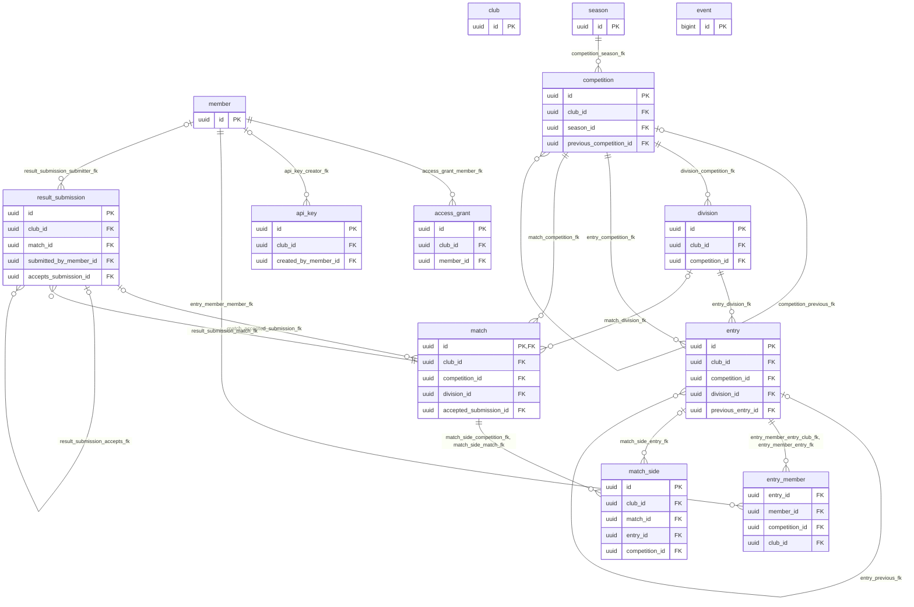

# Schema reference

Generated from the migrated database by `npm run db:docs`. Do not edit this
file by hand: descriptions come from the `COMMENT ON` statements in the
migrations, so change those, then regenerate. See
[docs/DATA-MODEL.md](DATA-MODEL.md) for the reasoning behind this shape; this
file is only the column-by-column reference.

## Entity relationship diagram

Every table also carries a `club_id` that scopes it to one club, enforced by row-level security; the plain foreign key from each table's `club_id` to `club.id` is omitted below to keep the diagram readable.

## Tables

## club

One club running the league. The root of every tenant boundary: every other table is scoped to a club, directly or through its parents.

**Row-level security:** enabled (policies: `club_isolation`)

| Column | Type | Nullable | Default | Description |
| --- | --- | --- | --- | --- |
| `id` | `uuid` | no | `gen_random_uuid()` | Primary key. The application generates a UUIDv7 so ids sort chronologically and player-facing URLs can't be enumerated; the column default (gen_random_uuid()) is only a fallback for rows inserted without one. |
| `slug` | `text` | no | — | The club's short, URL-safe name, unique on this instance. How people and tools refer to the club; never a way in: every request needs a credential. |
| `name` | `text` | no | — | The club's display name. |
| `timezone` | `text` | no | `'Europe/London'::text` | IANA time zone name (e.g. 'Europe/London'). Every deadline and days-remaining count is interpreted in this zone, never the server's. |
| `branding` | `jsonb` | no | `'{}'::jsonb` | Logo, colours and sponsor blocks, served to every client so it renders as the club's own site rather than a generic one. |
| `settings` | `jsonb` | no | `'{}'::jsonb` | Club-level settings, as JSON. Nothing in the core reads it yet. |
| `created_at` | `timestamp with time zone` | no | `now()` | When this row was created. |
| `updated_at` | `timestamp with time zone` | no | `now()` | When this row was last changed. |

**Primary key:** `club_pkey` (`id`)

**Unique constraints:**

- `club_slug_unique`: (`slug`)

**Indexes:**

- `club_pkey`: `CREATE UNIQUE INDEX club_pkey ON public.club USING btree (id)`
- `club_slug_unique`: `CREATE UNIQUE INDEX club_slug_unique ON public.club USING btree (slug)`

**Referenced by:**

- `access_grant` (`club_id`) via `access_grant_club_id_club_id_fk`
- `api_key` (`club_id`) via `api_key_club_id_club_id_fk`
- `competition` (`club_id`) via `competition_club_id_club_id_fk`
- `division` (`club_id`) via `division_club_id_club_id_fk`
- `entry` (`club_id`) via `entry_club_id_club_id_fk`
- `event` (`club_id`) via `event_club_id_club_id_fk`
- `match` (`club_id`) via `match_club_id_club_id_fk`
- `match_side` (`club_id`) via `match_side_club_id_club_id_fk`
- `member` (`club_id`) via `member_club_id_club_id_fk`
- `result_submission` (`club_id`) via `result_submission_club_id_club_id_fk`
- `season` (`club_id`) via `season_club_id_club_id_fk`

## member

A person at the club, most often a player. Soft-deleted, never hard-deleted, because historical results have to survive someone leaving and coming back.

**Row-level security:** enabled (policies: `tenant_isolation`)

| Column | Type | Nullable | Default | Description |
| --- | --- | --- | --- | --- |
| `id` | `uuid` | no | `gen_random_uuid()` | Primary key. The application generates a UUIDv7 so ids sort chronologically and player-facing URLs can't be enumerated; the column default (gen_random_uuid()) is only a fallback for rows inserted without one. |
| `club_id` | `uuid` | no | — | Which club this row belongs to. Enforced by a row-level security policy comparing it to deuceleague_current_club(). |
| `display_name` | `text` | no | — | The only name that appears in player-scoped responses; full identity fields require the members:pii scope. |
| `full_name` | `text` | yes | — | PII (members:pii scope). This member's full name. |
| `email` | `text` | yes | — | PII (members:pii scope). This member's email address. |
| `phone` | `text` | yes | — | PII (members:pii scope). This member's phone number. |
| `date_of_birth` | `date` | yes | — | PII (members:pii scope). This member's date of birth. |
| `gender` | `text` | yes | — | PII (members:pii scope). Recorded only to warn on an ineligible mixed-doubles pairing; never enforced, and the coach's confirmation always wins. Nullable by design. |
| `notes` | `text` | yes | — | PII (members:pii scope). Free-text notes about this member. |
| `rating` | `numeric(6,3)` | yes | — | A playing rating for this member, in the system named by rating_system. Stored, never computed: rating computation is deliberately outside the core. |
| `rating_system` | `text` | yes | — | Which rating system rating is expressed in. |
| `status` | `text` | no | `'active'::text` | Whether this member is currently active, paused, or has left the club. |
| `joined_on` | `date` | yes | — | The date this member joined the club. |
| `deleted_at` | `timestamp with time zone` | yes | — | Soft-delete marker. Members leave and come back, and their historical results have to survive them, so rows are never hard-deleted. |
| `created_at` | `timestamp with time zone` | no | `now()` | When this row was created. |
| `updated_at` | `timestamp with time zone` | no | `now()` | When this row was last changed. |

**Primary key:** `member_pkey` (`id`)

**Foreign keys:**

- (`club_id`) → `club` (`id`), ON DELETE cascade — `member_club_id_club_id_fk`

**Unique constraints:**

- `member_id_club_uq`: (`id`, `club_id`)

**Indexes:**

- `member_club_email_uq`: `CREATE UNIQUE INDEX member_club_email_uq ON public.member USING btree (club_id, lower(email)) WHERE ((deleted_at IS NULL) AND (email IS NOT NULL))`
- `member_club_status_ix`: `CREATE INDEX member_club_status_ix ON public.member USING btree (club_id, status) WHERE (deleted_at IS NULL)`
- `member_id_club_uq`: `CREATE UNIQUE INDEX member_id_club_uq ON public.member USING btree (id, club_id)`
- `member_pkey`: `CREATE UNIQUE INDEX member_pkey ON public.member USING btree (id)`

**Check constraints:**

- `member_gender_ck`: `CHECK ((gender = ANY (ARRAY['female'::text, 'male'::text, 'other'::text, 'undisclosed'::text])))`
- `member_status_ck`: `CHECK ((status = ANY (ARRAY['active'::text, 'paused'::text, 'left'::text])))`

**Referenced by:**

- `access_grant` (`member_id`, `club_id`) via `access_grant_member_fk`
- `api_key` (`created_by_member_id`, `club_id`) via `api_key_creator_fk`
- `entry_member` (`member_id`, `club_id`) via `entry_member_member_fk`
- `result_submission` (`submitted_by_member_id`, `club_id`) via `result_submission_submitter_fk`

## api_key

A credential for a non-member client — a bot, an app — to call the API as this club. The key itself is shown once, at creation; only its hash is stored.

**Row-level security:** enabled (policies: `tenant_isolation`)

| Column | Type | Nullable | Default | Description |
| --- | --- | --- | --- | --- |
| `id` | `uuid` | no | `gen_random_uuid()` | Primary key. The application generates a UUIDv7 so ids sort chronologically and player-facing URLs can't be enumerated; the column default (gen_random_uuid()) is only a fallback for rows inserted without one. |
| `club_id` | `uuid` | no | — | Which club this row belongs to. Enforced by a row-level security policy comparing it to deuceleague_current_club(). |
| `name` | `text` | no | — | What this key is for, e.g. 'Telegram bot' or 'Sam's iOS app' — set by whoever creates it, so a coach can tell their keys apart. |
| `key_hash` | `text` | no | — | SHA-256 hash of the key. The key itself is shown exactly once, at creation, and only this hash is stored. |
| `prefix` | `text` | no | — | The key's leading characters, kept unhashed so a coach can recognise a key in a list without being able to reconstruct it. |
| `scopes` | `text[]` | no | `'{league:read,results:write}'::text[]` | Which scopes this key grants (see docs/DATA-MODEL.md § Scopes). A new key defaults to league:read and results:write. |
| `created_by_member_id` | `uuid` | yes | — | Which member created this key, if any. |
| `last_used_at` | `timestamp with time zone` | yes | — | When this key was last used to authenticate a request. |
| `expires_at` | `timestamp with time zone` | yes | — | When this key stops being valid. Null means it does not expire on its own. |
| `revoked_at` | `timestamp with time zone` | yes | — | When this key was revoked. A revoked key is refused by deuceleague_resolve_api_key() even if it has not expired. |
| `created_at` | `timestamp with time zone` | no | `now()` | When this row was created. |

**Primary key:** `api_key_pkey` (`id`)

**Foreign keys:**

- (`club_id`) → `club` (`id`), ON DELETE cascade — `api_key_club_id_club_id_fk`
- (`created_by_member_id`, `club_id`) → `member` (`id`, `club_id`), ON DELETE no action — `api_key_creator_fk`

**Unique constraints:**

- `api_key_key_hash_unique`: (`key_hash`)

**Indexes:**

- `api_key_club_ix`: `CREATE INDEX api_key_club_ix ON public.api_key USING btree (club_id) WHERE (revoked_at IS NULL)`
- `api_key_key_hash_unique`: `CREATE UNIQUE INDEX api_key_key_hash_unique ON public.api_key USING btree (key_hash)`
- `api_key_pkey`: `CREATE UNIQUE INDEX api_key_pkey ON public.api_key USING btree (id)`

**Referenced by:**

- (nothing)

## access_grant

A short-lived, single-member token backing magic links and player sessions.

**Row-level security:** enabled (policies: `tenant_isolation`)

| Column | Type | Nullable | Default | Description |
| --- | --- | --- | --- | --- |
| `id` | `uuid` | no | `gen_random_uuid()` | Primary key. The application generates a UUIDv7 so ids sort chronologically and player-facing URLs can't be enumerated; the column default (gen_random_uuid()) is only a fallback for rows inserted without one. |
| `club_id` | `uuid` | no | — | Which club this row belongs to. Enforced by a row-level security policy comparing it to deuceleague_current_club(). |
| `member_id` | `uuid` | no | — | Which member this grant authenticates. Unlike an API key, a grant always speaks for exactly one member. |
| `token_hash` | `text` | no | — | SHA-256 hash of the token. The token itself is shown once, in the magic link or session cookie, and only this hash is stored. |
| `scopes` | `text[]` | no | — | Which scopes this grant carries. |
| `expires_at` | `timestamp with time zone` | no | — | When this grant stops being valid. |
| `used_at` | `timestamp with time zone` | yes | — | When a one-time magic link was first used. A session token ignores this; the API refuses reuse only for the former. |
| `created_at` | `timestamp with time zone` | no | `now()` | When this row was created. |

**Primary key:** `access_grant_pkey` (`id`)

**Foreign keys:**

- (`club_id`) → `club` (`id`), ON DELETE cascade — `access_grant_club_id_club_id_fk`
- (`member_id`, `club_id`) → `member` (`id`, `club_id`), ON DELETE cascade — `access_grant_member_fk`

**Unique constraints:**

- `access_grant_token_hash_unique`: (`token_hash`)

**Indexes:**

- `access_grant_expiry_ix`: `CREATE INDEX access_grant_expiry_ix ON public.access_grant USING btree (expires_at)`
- `access_grant_pkey`: `CREATE UNIQUE INDEX access_grant_pkey ON public.access_grant USING btree (id)`
- `access_grant_token_hash_unique`: `CREATE UNIQUE INDEX access_grant_token_hash_unique ON public.access_grant USING btree (token_hash)`

**Referenced by:**

- (nothing)

## season

A competitive period the club defines. Most run four a year, on dates the coach picks; every competition and division inside a season shares its dates and results deadline.

**Row-level security:** enabled (policies: `tenant_isolation`)

| Column | Type | Nullable | Default | Description |
| --- | --- | --- | --- | --- |
| `id` | `uuid` | no | `gen_random_uuid()` | Primary key. The application generates a UUIDv7 so ids sort chronologically and player-facing URLs can't be enumerated; the column default (gen_random_uuid()) is only a fallback for rows inserted without one. |
| `club_id` | `uuid` | no | — | Which club this row belongs to. Enforced by a row-level security policy comparing it to deuceleague_current_club(). |
| `name` | `text` | no | — | The season's name, e.g. 'Spring 2026'. Unique within the club. |
| `kind` | `text` | yes | — | Optional label for a club running a quarterly cadence (spring, summer, autumn, winter). Clubs that don't run seasons this way leave it null. |
| `year` | `integer` | yes | — | Optional label year, alongside kind. |
| `starts_on` | `date` | yes | — | When the season begins. Null while the season is still being planned; required before it can be activated. |
| `ends_on` | `date` | yes | — | When the season ends. Must not be before starts_on. |
| `results_deadline_at` | `timestamp with time zone` | yes | — | The single deadline for every competition and division in this season to have results in. |
| `state` | `text` | no | `'planning'::text` | Where this season is in its lifecycle: planning, active, complete or archived. |
| `created_at` | `timestamp with time zone` | no | `now()` | When this row was created. |
| `updated_at` | `timestamp with time zone` | no | `now()` | When this row was last changed. |

**Primary key:** `season_pkey` (`id`)

**Foreign keys:**

- (`club_id`) → `club` (`id`), ON DELETE cascade — `season_club_id_club_id_fk`

**Unique constraints:**

- `season_club_name_uq`: (`club_id`, `name`)
- `season_id_club_uq`: (`id`, `club_id`)

**Indexes:**

- `season_club_name_uq`: `CREATE UNIQUE INDEX season_club_name_uq ON public.season USING btree (club_id, name)`
- `season_club_state_ix`: `CREATE INDEX season_club_state_ix ON public.season USING btree (club_id, state)`
- `season_id_club_uq`: `CREATE UNIQUE INDEX season_id_club_uq ON public.season USING btree (id, club_id)`
- `season_pkey`: `CREATE UNIQUE INDEX season_pkey ON public.season USING btree (id)`

**Check constraints:**

- `season_dates_ck`: `CHECK (((starts_on IS NULL) OR (ends_on IS NULL) OR (ends_on >= starts_on)))`
- `season_kind_ck`: `CHECK ((kind = ANY (ARRAY['spring'::text, 'summer'::text, 'autumn'::text, 'winter'::text])))`
- `season_state_ck`: `CHECK ((state = ANY (ARRAY['planning'::text, 'active'::text, 'complete'::text, 'archived'::text])))`

**Referenced by:**

- `competition` (`season_id`, `club_id`) via `competition_season_fk`

## competition

One league within a season, e.g. Men's Singles or Mixed Doubles. Carries its own match format and rules, so different competitions can play different formats.

**Row-level security:** enabled (policies: `tenant_isolation`)

| Column | Type | Nullable | Default | Description |
| --- | --- | --- | --- | --- |
| `id` | `uuid` | no | `gen_random_uuid()` | Primary key. The application generates a UUIDv7 so ids sort chronologically and player-facing URLs can't be enumerated; the column default (gen_random_uuid()) is only a fallback for rows inserted without one. |
| `club_id` | `uuid` | no | — | Which club this row belongs to. Enforced by a row-level security policy comparing it to deuceleague_current_club(). |
| `season_id` | `uuid` | no | — | Which season this competition runs within. Every competition and division in a season shares the season's dates and deadline. |
| `name` | `text` | no | — | The competition's name, e.g. 'Men's Singles'. Unique within its season. |
| `format_id` | `text` | no | `'box_league'::text` | Which format plugin drives fixture generation, standings and placement suggestions for this competition, e.g. 'box_league'. |
| `discipline` | `text` | no | — | Singles or doubles. Determines whether an entry has one member or two. |
| `category` | `text` | no | `'open'::text` | Eligibility grouping (open, mens, womens, mixed), advisory only. |
| `match_format` | `jsonb` | no | — | Defines what a legal score looks like for this competition — sets to win, games per set, tiebreak rules — as a MatchFormat document from @deuceleague/schema. validateResult() checks every submitted score against it. |
| `rules` | `jsonb` | no | — | How this competition's league works, as data: points per outcome, tiebreak ordering, promotion and relegation counts, what happens on a withdrawal. A RulesSpec document from @deuceleague/schema; see docs/DATA-MODEL.md § The two JSON documents. |
| `config` | `jsonb` | no | `'{}'::jsonb` | Settings specific to this competition's format plugin (format_id), validated by that plugin's own schema rather than by the core. |
| `sequence_in_season` | `integer` | no | `1` | Numbers box rounds when a club runs several inside one season. Most clubs leave this at 1 and chain rounds across seasons with previous_competition_id instead. |
| `previous_competition_id` | `uuid` | yes | — | The competition this one continues from, if any. Promotion and relegation suggestions are read from here. |
| `state` | `text` | no | `'draft'::text` | Where this competition is in its lifecycle: draft, active, complete or archived. |
| `visibility` | `text` | no | `'members'::text` | Who may see this competition, among those who have signed in: members (every member of the club) or private (the coach's own credentials only, never a player's login). Nothing is readable without a credential. |
| `created_at` | `timestamp with time zone` | no | `now()` | When this row was created. |
| `updated_at` | `timestamp with time zone` | no | `now()` | When this row was last changed. |

**Primary key:** `competition_pkey` (`id`)

**Foreign keys:**

- (`club_id`) → `club` (`id`), ON DELETE cascade — `competition_club_id_club_id_fk`
- (`previous_competition_id`, `club_id`) → `competition` (`id`, `club_id`), ON DELETE no action — `competition_previous_fk`
- (`season_id`, `club_id`) → `season` (`id`, `club_id`), ON DELETE cascade — `competition_season_fk`

**Unique constraints:**

- `competition_id_club_uq`: (`id`, `club_id`)
- `competition_season_name_uq`: (`season_id`, `name`)

**Indexes:**

- `competition_club_state_ix`: `CREATE INDEX competition_club_state_ix ON public.competition USING btree (club_id, state)`
- `competition_id_club_uq`: `CREATE UNIQUE INDEX competition_id_club_uq ON public.competition USING btree (id, club_id)`
- `competition_pkey`: `CREATE UNIQUE INDEX competition_pkey ON public.competition USING btree (id)`
- `competition_season_name_uq`: `CREATE UNIQUE INDEX competition_season_name_uq ON public.competition USING btree (season_id, name)`

**Check constraints:**

- `competition_category_ck`: `CHECK ((category = ANY (ARRAY['open'::text, 'mens'::text, 'womens'::text, 'mixed'::text])))`
- `competition_discipline_ck`: `CHECK ((discipline = ANY (ARRAY['singles'::text, 'doubles'::text])))`
- `competition_state_ck`: `CHECK ((state = ANY (ARRAY['draft'::text, 'active'::text, 'complete'::text, 'archived'::text])))`
- `competition_visibility_ck`: `CHECK ((visibility = ANY (ARRAY['members'::text, 'private'::text])))`

**Referenced by:**

- `competition` (`previous_competition_id`, `club_id`) via `competition_previous_fk`
- `division` (`competition_id`, `club_id`) via `division_competition_fk`
- `entry` (`competition_id`, `club_id`) via `entry_competition_fk`
- `match` (`competition_id`, `club_id`) via `match_competition_fk`

## division

A box within a competition. Size is simply however many entries it holds; there is no fixed structure.

**Row-level security:** enabled (policies: `tenant_isolation`)

| Column | Type | Nullable | Default | Description |
| --- | --- | --- | --- | --- |
| `id` | `uuid` | no | `gen_random_uuid()` | Primary key. The application generates a UUIDv7 so ids sort chronologically and player-facing URLs can't be enumerated; the column default (gen_random_uuid()) is only a fallback for rows inserted without one. |
| `club_id` | `uuid` | no | — | Which club this row belongs to. Enforced by a row-level security policy comparing it to deuceleague_current_club(). |
| `competition_id` | `uuid` | no | — | Which competition this division belongs to. |
| `ordinal` | `integer` | no | — | The division's rank within its competition. 1 is the top division. |
| `name` | `text` | no | — | The division's name, e.g. 'Division 1'. |
| `target_size` | `integer` | yes | — | Advisory target number of entries. Only informs placement suggestions; never enforced, and a division's actual size is however many entries it holds. |
| `created_at` | `timestamp with time zone` | no | `now()` | When this row was created. |
| `updated_at` | `timestamp with time zone` | no | `now()` | When this row was last changed. |

**Primary key:** `division_pkey` (`id`)

**Foreign keys:**

- (`club_id`) → `club` (`id`), ON DELETE cascade — `division_club_id_club_id_fk`
- (`competition_id`, `club_id`) → `competition` (`id`, `club_id`), ON DELETE cascade — `division_competition_fk`

**Unique constraints:**

- `division_competition_ordinal_uq`: (`competition_id`, `ordinal`)
- `division_id_club_uq`: (`id`, `club_id`)
- `division_id_competition_uq`: (`id`, `competition_id`)

**Indexes:**

- `division_competition_ordinal_uq`: `CREATE UNIQUE INDEX division_competition_ordinal_uq ON public.division USING btree (competition_id, ordinal)`
- `division_id_club_uq`: `CREATE UNIQUE INDEX division_id_club_uq ON public.division USING btree (id, club_id)`
- `division_id_competition_uq`: `CREATE UNIQUE INDEX division_id_competition_uq ON public.division USING btree (id, competition_id)`
- `division_pkey`: `CREATE UNIQUE INDEX division_pkey ON public.division USING btree (id)`

**Check constraints:**

- `division_ordinal_ck`: `CHECK ((ordinal >= 1))`

**Referenced by:**

- `entry` (`division_id`, `competition_id`) via `entry_division_fk`
- `match` (`division_id`, `competition_id`) via `match_division_fk`

## entry

One competing unit in one division: a single member for singles, a pair for doubles. Promotion and relegation move the whole entry, which is what keeps a doubles pair together.

**Row-level security:** enabled (policies: `tenant_isolation`)

| Column | Type | Nullable | Default | Description |
| --- | --- | --- | --- | --- |
| `id` | `uuid` | no | `gen_random_uuid()` | Primary key. The application generates a UUIDv7 so ids sort chronologically and player-facing URLs can't be enumerated; the column default (gen_random_uuid()) is only a fallback for rows inserted without one. |
| `club_id` | `uuid` | no | — | Which club this row belongs to. Enforced by a row-level security policy comparing it to deuceleague_current_club(). |
| `competition_id` | `uuid` | no | — | Which competition this entry belongs to. Denormalised from division_id so that 'one division per competition per member' (see entry_member) is a constraint the database can express. |
| `division_id` | `uuid` | no | — | Which division this entry currently sits in. |
| `display_name` | `text` | yes | — | An optional override for how this entry is displayed. Otherwise it is derived from its members' display names — see the entry_label view. |
| `seed` | `integer` | yes | — | An optional seeding number for this entry. Nothing in the core reads it yet. |
| `state` | `text` | no | `'active'::text` | Whether this entry is currently active or has withdrawn. |
| `placement_reason` | `text` | yes | — | Why this entry sits in this division: promoted, relegated, held, new, returning, or a manual override. Written when the coach confirms placements. |
| `previous_entry_id` | `uuid` | yes | — | The same competing unit's entry in the previous competition, if any, so movement history (promoted from Division 2, etc.) can be read off. |
| `withdrawn_at` | `timestamp with time zone` | yes | — | When this entry withdrew, if state is 'withdrawn'. |
| `created_at` | `timestamp with time zone` | no | `now()` | When this row was created. |
| `updated_at` | `timestamp with time zone` | no | `now()` | When this row was last changed. |

**Primary key:** `entry_pkey` (`id`)

**Foreign keys:**

- (`club_id`) → `club` (`id`), ON DELETE cascade — `entry_club_id_club_id_fk`
- (`competition_id`, `club_id`) → `competition` (`id`, `club_id`), ON DELETE cascade — `entry_competition_fk`
- (`division_id`, `competition_id`) → `division` (`id`, `competition_id`), ON DELETE cascade — `entry_division_fk`
- (`previous_entry_id`, `club_id`) → `entry` (`id`, `club_id`), ON DELETE no action — `entry_previous_fk`

**Unique constraints:**

- `entry_id_club_uq`: (`id`, `club_id`)
- `entry_id_competition_uq`: (`id`, `competition_id`)

**Indexes:**

- `entry_division_ix`: `CREATE INDEX entry_division_ix ON public.entry USING btree (division_id)`
- `entry_id_club_uq`: `CREATE UNIQUE INDEX entry_id_club_uq ON public.entry USING btree (id, club_id)`
- `entry_id_competition_uq`: `CREATE UNIQUE INDEX entry_id_competition_uq ON public.entry USING btree (id, competition_id)`
- `entry_pkey`: `CREATE UNIQUE INDEX entry_pkey ON public.entry USING btree (id)`

**Check constraints:**

- `entry_placement_reason_ck`: `CHECK ((placement_reason = ANY (ARRAY['promoted'::text, 'relegated'::text, 'held'::text, 'new'::text, 'returning'::text, 'manual'::text])))`
- `entry_state_ck`: `CHECK ((state = ANY (ARRAY['active'::text, 'withdrawn'::text])))`

**Referenced by:**

- `entry_member` (`entry_id`, `club_id`) via `entry_member_entry_club_fk`
- `entry_member` (`entry_id`, `competition_id`) via `entry_member_entry_fk`
- `entry` (`previous_entry_id`, `club_id`) via `entry_previous_fk`
- `match_side` (`entry_id`, `competition_id`) via `match_side_entry_fk`

## entry_member

Which members make up an entry: one row for singles, two for doubles.

**Row-level security:** enabled (policies: `tenant_isolation`)

| Column | Type | Nullable | Default | Description |
| --- | --- | --- | --- | --- |
| `entry_id` | `uuid` | no | — | Which entry this row belongs to. |
| `member_id` | `uuid` | no | — | Which member makes up part of the entry. |
| `competition_id` | `uuid` | no | — | Denormalised from the entry, so that UNIQUE (competition_id, member_id) can stop a member appearing in two divisions of the same competition. |
| `club_id` | `uuid` | no | — | Denormalised from the entry, so composite foreign keys can require the entry and the member to belong to the same club. Foreign-key checks ignore row-level security, so without this one club could put its member into another club's entry. |
| `role` | `text` | no | `'player'::text` | player or partner, defaulting to player. Orders a doubles pair on a results sheet: entry_label lists the player first. |
| `created_at` | `timestamp with time zone` | no | `now()` | When this row was created. |

**Primary key:** none — see the unique constraints below.

**Foreign keys:**

- (`entry_id`, `club_id`) → `entry` (`id`, `club_id`), ON DELETE cascade — `entry_member_entry_club_fk`
- (`entry_id`, `competition_id`) → `entry` (`id`, `competition_id`), ON DELETE cascade — `entry_member_entry_fk`
- (`member_id`, `club_id`) → `member` (`id`, `club_id`), ON DELETE no action — `entry_member_member_fk`

**Unique constraints:**

- `entry_member_one_division_uq`: (`competition_id`, `member_id`)
- `entry_member_pk`: (`entry_id`, `member_id`)

**Indexes:**

- `entry_member_member_ix`: `CREATE INDEX entry_member_member_ix ON public.entry_member USING btree (member_id)`
- `entry_member_one_division_uq`: `CREATE UNIQUE INDEX entry_member_one_division_uq ON public.entry_member USING btree (competition_id, member_id)`
- `entry_member_pk`: `CREATE UNIQUE INDEX entry_member_pk ON public.entry_member USING btree (entry_id, member_id)`

**Check constraints:**

- `entry_member_role_ck`: `CHECK ((role = ANY (ARRAY['player'::text, 'partner'::text])))`

**Referenced by:**

- (nothing)

## match

A pairing between two entries. A match with no score yet is a fixture — there is no separate fixture table.

**Row-level security:** enabled (policies: `tenant_isolation`)

| Column | Type | Nullable | Default | Description |
| --- | --- | --- | --- | --- |
| `id` | `uuid` | no | `gen_random_uuid()` | Primary key. The application generates a UUIDv7 so ids sort chronologically and player-facing URLs can't be enumerated; the column default (gen_random_uuid()) is only a fallback for rows inserted without one. |
| `club_id` | `uuid` | no | — | Which club this row belongs to. Enforced by a row-level security policy comparing it to deuceleague_current_club(). |
| `competition_id` | `uuid` | no | — | Which competition this match belongs to. |
| `division_id` | `uuid` | yes | — | Which division this match belongs to. Null for a friendly or any match generated outside a division. |
| `status` | `text` | no | `'open'::text` | This match's lifecycle: open (nobody has reported), reported (one side has claimed a score), played (both sides agree, or the coach decided), or disputed (both sides claimed and differ). Nothing moves to played on a timer — see docs/DATA-MODEL.md § Results. |
| `outcome` | `text` | yes | — | How the match ended: completed, retired, walkover, conceded, or unplayed. Set only once status is 'played'. |
| `played_on` | `date` | yes | — | The date the match was played, taken from the claim that settled it. |
| `score` | `jsonb` | yes | — | The accepted score, as a Score document from @deuceleague/schema. Present only when the match has actually been played (outcome is 'completed' or 'retired'). |
| `winning_side` | `integer` | yes | — | Which side won: 0 or 1, matching match_side.side_index. Set for every outcome except 'unplayed'. |
| `retired_side` | `integer` | yes | — | Which side retired, conceded, or failed to appear. Set only for those outcomes. |
| `accepted_submission_id` | `uuid` | yes | — | The claim that put this result in the ledger — the second of two matching reports, an acceptance, or a coach entry. Required once status is 'played', so every result traces back to someone saying it; the full trail of claims is in result_submission. |
| `pairing_key` | `text` | yes | — | A key identifying this pairing (sorted entry ids), used to make fixture generation idempotent: re-running it cannot create the same pairing twice within a division. |
| `created_at` | `timestamp with time zone` | no | `now()` | When this row was created. |
| `updated_at` | `timestamp with time zone` | no | `now()` | When this row was last changed. |

**Primary key:** `match_pkey` (`id`)

**Foreign keys:**

- (`accepted_submission_id`, `id`) → `result_submission` (`id`, `match_id`), ON DELETE no action — `match_accepted_submission_fk`
- (`club_id`) → `club` (`id`), ON DELETE cascade — `match_club_id_club_id_fk`
- (`competition_id`, `club_id`) → `competition` (`id`, `club_id`), ON DELETE cascade — `match_competition_fk`
- (`division_id`, `competition_id`) → `division` (`id`, `competition_id`), ON DELETE cascade — `match_division_fk`

**Unique constraints:**

- `match_id_club_uq`: (`id`, `club_id`)
- `match_id_competition_uq`: (`id`, `competition_id`)

**Indexes:**

- `match_competition_status_ix`: `CREATE INDEX match_competition_status_ix ON public.match USING btree (competition_id, status)`
- `match_division_ix`: `CREATE INDEX match_division_ix ON public.match USING btree (division_id)`
- `match_division_pairing_uq`: `CREATE UNIQUE INDEX match_division_pairing_uq ON public.match USING btree (division_id, pairing_key) WHERE (pairing_key IS NOT NULL)`
- `match_id_club_uq`: `CREATE UNIQUE INDEX match_id_club_uq ON public.match USING btree (id, club_id)`
- `match_id_competition_uq`: `CREATE UNIQUE INDEX match_id_competition_uq ON public.match USING btree (id, competition_id)`
- `match_outstanding_ix`: `CREATE INDEX match_outstanding_ix ON public.match USING btree (competition_id) WHERE (status = ANY (ARRAY['open'::text, 'reported'::text, 'disputed'::text]))`
- `match_pkey`: `CREATE UNIQUE INDEX match_pkey ON public.match USING btree (id)`

**Check constraints:**

- `match_outcome_ck`: `CHECK ((outcome = ANY (ARRAY['completed'::text, 'retired'::text, 'walkover'::text, 'conceded'::text, 'unplayed'::text])))`
- `match_played_claim_ck`: `CHECK (((status = 'played'::text) = (accepted_submission_id IS NOT NULL)))`
- `match_played_outcome_ck`: `CHECK (((status = 'played'::text) = (outcome IS NOT NULL)))`
- `match_retired_side_ck`: `CHECK (((retired_side IS NULL) OR (retired_side = ANY (ARRAY[0, 1]))))`
- `match_score_ck`: `CHECK (((score IS NOT NULL) = COALESCE((outcome = ANY (ARRAY['completed'::text, 'retired'::text])), false)))`
- `match_status_ck`: `CHECK ((status = ANY (ARRAY['open'::text, 'reported'::text, 'played'::text, 'disputed'::text])))`
- `match_stopped_side_ck`: `CHECK (((retired_side IS NOT NULL) = COALESCE((outcome = ANY (ARRAY['retired'::text, 'walkover'::text, 'conceded'::text])), false)))`
- `match_winner_ck`: `CHECK (((winning_side IS NOT NULL) = ((outcome IS NOT NULL) AND (outcome <> 'unplayed'::text))))`
- `match_winner_not_retired_ck`: `CHECK ((winning_side <> retired_side))`
- `match_winning_side_ck`: `CHECK (((winning_side IS NULL) OR (winning_side = ANY (ARRAY[0, 1]))))`

**Referenced by:**

- `match_side` (`match_id`, `competition_id`) via `match_side_competition_fk`
- `match_side` (`match_id`, `club_id`) via `match_side_match_fk`
- `result_submission` (`match_id`, `club_id`) via `result_submission_match_fk`

## match_side

One side of a match: which entry was drawn to play it.

**Row-level security:** enabled (policies: `tenant_isolation`)

| Column | Type | Nullable | Default | Description |
| --- | --- | --- | --- | --- |
| `id` | `uuid` | no | `gen_random_uuid()` | Primary key. The application generates a UUIDv7 so ids sort chronologically and player-facing URLs can't be enumerated; the column default (gen_random_uuid()) is only a fallback for rows inserted without one. |
| `club_id` | `uuid` | no | — | Which club this row belongs to. Enforced by a row-level security policy comparing it to deuceleague_current_club(). |
| `match_id` | `uuid` | no | — | Which match this is a side of. |
| `side_index` | `integer` | no | — | Which side this is: 0 or 1. |
| `entry_id` | `uuid` | yes | — | The entry drawn to play this side. Who actually took the court is recorded separately in match_participant, so a stand-in does not corrupt the entry's standing. |
| `created_at` | `timestamp with time zone` | no | `now()` | When this row was created. |
| `competition_id` | `uuid` | no | — | Denormalised from the match, so this side's entry can be required (by a composite foreign key) to come from the same competition as the match. |

**Primary key:** `match_side_pkey` (`id`)

**Foreign keys:**

- (`club_id`) → `club` (`id`), ON DELETE cascade — `match_side_club_id_club_id_fk`
- (`match_id`, `competition_id`) → `match` (`id`, `competition_id`), ON DELETE cascade — `match_side_competition_fk`
- (`entry_id`, `competition_id`) → `entry` (`id`, `competition_id`), ON DELETE no action — `match_side_entry_fk`
- (`match_id`, `club_id`) → `match` (`id`, `club_id`), ON DELETE cascade — `match_side_match_fk`

**Unique constraints:**

- `match_side_id_club_uq`: (`id`, `club_id`)
- `match_side_match_entry_uq`: (`match_id`, `entry_id`)
- `match_side_match_index_uq`: (`match_id`, `side_index`)

**Indexes:**

- `match_side_entry_ix`: `CREATE INDEX match_side_entry_ix ON public.match_side USING btree (entry_id)`
- `match_side_id_club_uq`: `CREATE UNIQUE INDEX match_side_id_club_uq ON public.match_side USING btree (id, club_id)`
- `match_side_match_entry_uq`: `CREATE UNIQUE INDEX match_side_match_entry_uq ON public.match_side USING btree (match_id, entry_id)`
- `match_side_match_index_uq`: `CREATE UNIQUE INDEX match_side_match_index_uq ON public.match_side USING btree (match_id, side_index)`
- `match_side_pkey`: `CREATE UNIQUE INDEX match_side_pkey ON public.match_side USING btree (id)`

**Check constraints:**

- `match_side_index_ck`: `CHECK ((side_index = ANY (ARRAY[0, 1])))`

**Referenced by:**

- (nothing)

## result_submission

Every claim ever made about a match's result — who said what, from where, and what it superseded. The match row holds only the currently accepted score; this table holds the full trail.

**Row-level security:** enabled (policies: `tenant_isolation`)

| Column | Type | Nullable | Default | Description |
| --- | --- | --- | --- | --- |
| `id` | `uuid` | no | `gen_random_uuid()` | Primary key. The application generates a UUIDv7 so ids sort chronologically and player-facing URLs can't be enumerated; the column default (gen_random_uuid()) is only a fallback for rows inserted without one. |
| `club_id` | `uuid` | no | — | Which club this row belongs to. Enforced by a row-level security policy comparing it to deuceleague_current_club(). |
| `match_id` | `uuid` | no | — | Which match this claim is about. |
| `submitted_by_member_id` | `uuid` | yes | — | Which member submitted this claim. Null when it was entered by a coach through an API key rather than as a member. |
| `submitted_at` | `timestamp with time zone` | no | `now()` | When this claim was submitted. |
| `score` | `jsonb` | yes | — | The score this claim asserts, as a Score document. Present only when outcome is 'completed' or 'retired'. |
| `outcome` | `text` | no | — | How this claim says the match ended: completed, retired, walkover, conceded, or unplayed. |
| `retired_side` | `integer` | yes | — | Which side this claim says retired, conceded, or failed to appear. |
| `state` | `text` | no | `'pending'::text` | Whether this claim is still live (pending), has entered the ledger (confirmed), or has been replaced (superseded). There is no 'rejected': a side replaces its own claim, it does not reject the other's. |
| `confirmed_at` | `timestamp with time zone` | yes | — | When this claim entered the ledger. Who agreed is recorded on the other side's claim, not here. |
| `source` | `text` | no | — | Where this claim came from: web, telegram, api, coach_entry, or nl_parse. |
| `raw_input` | `text` | yes | — | What the player actually typed, kept to debug a bad natural-language parse and to build the eval set for improving the parser. |
| `created_at` | `timestamp with time zone` | no | `now()` | When this row was created. |
| `side_index` | `integer` | yes | — | Which side is making this claim, matching match_side.side_index. Null only for a coach entry, which speaks for the match as a whole and settles it, so it is never left pending. A bot reporting for a player uses that player's side. |
| `accepts_submission_id` | `uuid` | yes | — | Set when this claim is the other side pressing 'accept' rather than reporting a score of its own; must point at a claim with the same score, on the same match. Null means this claim is an independent report. |
| `played_on` | `date` | yes | — | The date this side says the match was played. Never compared between sides — remembering the day differently is not a dispute. |

**Primary key:** `result_submission_pkey` (`id`)

**Foreign keys:**

- (`accepts_submission_id`, `match_id`) → `result_submission` (`id`, `match_id`), ON DELETE no action — `result_submission_accepts_fk`
- (`club_id`) → `club` (`id`), ON DELETE cascade — `result_submission_club_id_club_id_fk`
- (`match_id`, `club_id`) → `match` (`id`, `club_id`), ON DELETE cascade — `result_submission_match_fk`
- (`submitted_by_member_id`, `club_id`) → `member` (`id`, `club_id`), ON DELETE no action — `result_submission_submitter_fk`

**Unique constraints:**

- `result_submission_id_club_uq`: (`id`, `club_id`)
- `result_submission_id_match_uq`: (`id`, `match_id`)

**Indexes:**

- `result_submission_id_club_uq`: `CREATE UNIQUE INDEX result_submission_id_club_uq ON public.result_submission USING btree (id, club_id)`
- `result_submission_id_match_uq`: `CREATE UNIQUE INDEX result_submission_id_match_uq ON public.result_submission USING btree (id, match_id)`
- `result_submission_match_ix`: `CREATE INDEX result_submission_match_ix ON public.result_submission USING btree (match_id)`
- `result_submission_one_pending_per_side_uq`: `CREATE UNIQUE INDEX result_submission_one_pending_per_side_uq ON public.result_submission USING btree (match_id, side_index) WHERE ((state = 'pending'::text) AND (side_index IS NOT NULL))`
- `result_submission_pkey`: `CREATE UNIQUE INDEX result_submission_pkey ON public.result_submission USING btree (id)`

**Check constraints:**

- `result_submission_accepts_side_ck`: `CHECK (((accepts_submission_id IS NULL) OR (side_index IS NOT NULL)))`
- `result_submission_outcome_ck`: `CHECK ((outcome = ANY (ARRAY['completed'::text, 'retired'::text, 'walkover'::text, 'conceded'::text, 'unplayed'::text])))`
- `result_submission_score_ck`: `CHECK (((score IS NOT NULL) = COALESCE((outcome = ANY (ARRAY['completed'::text, 'retired'::text])), false)))`
- `result_submission_side_index_ck`: `CHECK (((side_index IS NULL) OR (side_index = ANY (ARRAY[0, 1]))))`
- `result_submission_sideless_ck`: `CHECK (((side_index IS NOT NULL) OR (state <> 'pending'::text)))`
- `result_submission_source_ck`: `CHECK ((source = ANY (ARRAY['web'::text, 'telegram'::text, 'api'::text, 'coach_entry'::text, 'nl_parse'::text])))`
- `result_submission_state_ck`: `CHECK ((state = ANY (ARRAY['pending'::text, 'confirmed'::text, 'superseded'::text])))`
- `result_submission_stopped_side_ck`: `CHECK (((retired_side IS NOT NULL) = COALESCE((outcome = ANY (ARRAY['retired'::text, 'walkover'::text, 'conceded'::text])), false)))`

**Referenced by:**

- `match` (`accepted_submission_id`, `id`) via `match_accepted_submission_fk`
- `result_submission` (`accepts_submission_id`, `match_id`) via `result_submission_accepts_fk`

## event

An append-only log of everything that happened: both the audit trail and the webhook outbox adapters read from.

**Row-level security:** enabled (policies: `tenant_isolation`)

| Column | Type | Nullable | Default | Description |
| --- | --- | --- | --- | --- |
| `id` | `bigint` | no | `nextval('event_id_seq'::regclass)` | Primary key, an increasing sequence — but not in commit order, so never page on it alone. See tx_id and the event_feed view. |
| `club_id` | `uuid` | no | — | Which club this row belongs to. Enforced by a row-level security policy comparing it to deuceleague_current_club(). |
| `occurred_at` | `timestamp with time zone` | no | `now()` | When this event happened. |
| `type` | `text` | no | — | A dotted event name, e.g. 'match.result.confirmed'. |
| `subject_type` | `text` | no | — | What kind of thing this event is about, e.g. 'match'. |
| `subject_id` | `uuid` | yes | — | The id of the thing this event is about. |
| `actor_type` | `text` | no | — | What kind of actor caused this event: member, api_key, or system. |
| `actor_id` | `uuid` | yes | — | The id of the actor that caused this event, if any. |
| `payload` | `jsonb` | no | `'{}'::jsonb` | The event's data, as JSON. Its shape depends on type. |
| `tx_id` | `xid8` | no | `pg_current_xact_id()` | The id of the transaction that wrote this event. Event ids are handed out before commit, so a slow transaction can commit a lower id after a higher one is already visible; paging by (tx_id, id) through event_feed is how a reader avoids skipping it. |

**Primary key:** `event_pkey` (`id`)

**Foreign keys:**

- (`club_id`) → `club` (`id`), ON DELETE cascade — `event_club_id_club_id_fk`

**Indexes:**

- `event_club_ix`: `CREATE INDEX event_club_ix ON public.event USING btree (club_id, id)`
- `event_club_type_ix`: `CREATE INDEX event_club_type_ix ON public.event USING btree (club_id, type, id)`
- `event_feed_ix`: `CREATE INDEX event_feed_ix ON public.event USING btree (club_id, tx_id, id)`
- `event_pkey`: `CREATE UNIQUE INDEX event_pkey ON public.event USING btree (id)`
- `event_subject_ix`: `CREATE INDEX event_subject_ix ON public.event USING btree (club_id, subject_type, subject_id)`

**Check constraints:**

- `event_actor_type_ck`: `CHECK ((actor_type = ANY (ARRAY['member'::text, 'api_key'::text, 'system'::text])))`

**Referenced by:**

- (nothing)

## Views

## entry_label

How a competing unit is written on a results sheet: the entry's own display name if it has one, otherwise its members joined by ' / ', player before partner.

| Column | Type | Description |
| --- | --- | --- |
| `entry_id` | `uuid` |  |
| `club_id` | `uuid` |  |
| `competition_id` | `uuid` |  |
| `division_id` | `uuid` |  |
| `state` | `text` |  |
| `label` | `text` | How this entry is written on a results sheet: its own display_name if set, otherwise its members' display names joined by ' / ', player before partner. |
| `member_ids` | `uuid[]` | The ids of the members making up this entry, in the same order as label. |

## division_progress

How far through one division is: how many matches are played, outstanding, reported or disputed, and how many days are left to the season's results deadline.

| Column | Type | Description |
| --- | --- | --- |
| `club_id` | `uuid` |  |
| `competition_id` | `uuid` |  |
| `competition_name` | `text` |  |
| `division_id` | `uuid` |  |
| `division_ordinal` | `integer` |  |
| `division_name` | `text` |  |
| `season_id` | `uuid` |  |
| `season_name` | `text` |  |
| `results_deadline_at` | `timestamp with time zone` |  |
| `days_remaining` | `integer` | Whole days remaining to the season's results deadline, counted on the club's own calendar (club.timezone), not the server's. |
| `active_entries` | `bigint` | How many entries in this division are currently active (not withdrawn). |
| `matches` | `bigint` | How many matches this division has in total. |
| `played` | `bigint` | How many of this division's matches have a result in the ledger. |
| `outstanding` | `bigint` | How many of this division's matches are not yet in the ledger — open, reported or disputed. |
| `reported` | `bigint` | How many matches have one side's claim in, waiting on the other. |
| `disputed` | `bigint` | How many matches have two claims that disagree, waiting on a player to re-enter or the coach to settle it. |
| `percent_played` | `numeric` | The percentage of this division's matches that have been played, to one decimal place. |

## competition_progress

The same figures as division_progress, rolled up to a whole competition.

| Column | Type | Description |
| --- | --- | --- |
| `club_id` | `uuid` |  |
| `competition_id` | `uuid` |  |
| `competition_name` | `text` |  |
| `season_id` | `uuid` |  |
| `season_name` | `text` |  |
| `results_deadline_at` | `timestamp with time zone` |  |
| `days_remaining` | `integer` | Whole days remaining to the season's results deadline. See the same column on division_progress. |
| `divisions` | `bigint` | How many divisions this competition has. |
| `active_entries` | `numeric` | Summed across the competition's divisions. See the same column on division_progress. |
| `matches` | `numeric` | Summed across the competition's divisions. See the same column on division_progress. |
| `played` | `numeric` | Summed across the competition's divisions. See the same column on division_progress. |
| `outstanding` | `numeric` | Summed across the competition's divisions. See the same column on division_progress. |
| `reported` | `numeric` | Summed across the competition's divisions. See the same column on division_progress. |
| `disputed` | `numeric` | Summed across the competition's divisions. See the same column on division_progress. |
| `percent_played` | `numeric` | The percentage of the competition's matches that have been played, to one decimal place. |

## entry_progress

Played and outstanding matches for one competing unit.

| Column | Type | Description |
| --- | --- | --- |
| `club_id` | `uuid` |  |
| `competition_id` | `uuid` |  |
| `division_id` | `uuid` |  |
| `entry_id` | `uuid` |  |
| `label` | `text` |  |
| `member_ids` | `uuid[]` |  |
| `state` | `text` |  |
| `matches` | `bigint` | How many matches this entry has in total. |
| `played` | `bigint` | How many of this entry's matches have a result in the ledger. |
| `outstanding` | `bigint` | How many of this entry's matches are not yet in the ledger. |

## outstanding_match

Every match not yet in the ledger, with both sides named.

| Column | Type | Description |
| --- | --- | --- |
| `club_id` | `uuid` |  |
| `competition_id` | `uuid` |  |
| `competition_name` | `text` |  |
| `division_id` | `uuid` |  |
| `division_name` | `text` |  |
| `division_ordinal` | `integer` |  |
| `match_id` | `uuid` |  |
| `status` | `text` |  |
| `results_deadline_at` | `timestamp with time zone` |  |
| `days_remaining` | `integer` | Whole days remaining to the season's results deadline, counted on the club's own calendar. See division_progress. |
| `side0_entry_id` | `uuid` |  |
| `side0_label` | `text` |  |
| `side0_member_ids` | `uuid[]` |  |
| `side0_claimed` | `boolean` | Whether side 0 currently has a live (pending) claim standing on this match. |
| `side1_entry_id` | `uuid` |  |
| `side1_label` | `text` |  |
| `side1_member_ids` | `uuid[]` |  |
| `side1_claimed` | `boolean` | Whether side 1 currently has a live (pending) claim standing on this match. |

## member_chase_list

One row per member per division with matches outstanding, split by what is actually needed from them, for driving reminders. The core does not send anything — this view only answers the question.

| Column | Type | Description |
| --- | --- | --- |
| `club_id` | `uuid` |  |
| `competition_id` | `uuid` |  |
| `competition_name` | `text` |  |
| `division_id` | `uuid` |  |
| `division_name` | `text` |  |
| `division_ordinal` | `integer` |  |
| `member_id` | `uuid` |  |
| `display_name` | `text` |  |
| `email` | `text` | PII (members:pii scope). This member's email address, exposed here because a reminder workflow needs it. The API must gate it behind the members:pii scope itself — row-level security does not enforce scopes. |
| `outstanding_matches` | `bigint` | How many of this member's matches in this division are not yet in the ledger. Always needs_playing + awaiting_you + awaiting_them. |
| `needs_playing` | `bigint` | How many of those matches have no claim from either side yet: nobody has reported a result. |
| `awaiting_you` | `bigint` | How many of those matches have a score in from the opponent that this member has not agreed to, either unanswered or disputed. Accepting it clears the match in one click; so does either side correcting its score to match. |
| `awaiting_them` | `bigint` | How many of those matches this member has claimed, waiting on the opponent to respond. |
| `days_remaining` | `integer` | Whole days remaining to the season's results deadline, counted on the club's own calendar. See division_progress. |
| `waiting_on` | `text[]` | The opponents this member has matches outstanding against, written as on a results sheet (see entry_label). |

## event_feed

The event log in the order a consumer should read it: an event is held back until its own transaction, and every earlier one, has committed, so paging on (tx_id, id) never skips one that committed late.

| Column | Type | Description |
| --- | --- | --- |
| `id` | `bigint` |  |
| `tx_id` | `xid8` | The id of the transaction that wrote this event; page on (tx_id, id) rather than id alone so a slow transaction's event is never skipped once it lands. |
| `club_id` | `uuid` |  |
| `occurred_at` | `timestamp with time zone` |  |
| `type` | `text` |  |
| `subject_type` | `text` |  |
| `subject_id` | `uuid` |  |
| `actor_type` | `text` |  |
| `actor_id` | `uuid` |  |
| `payload` | `jsonb` |  |

## Functions

### `deuceleague_current_club()`

Returns `uuid`.

Returns the club id set on this connection with SET LOCAL app.club_id, or null if none is set. Every row-level security policy compares a row's club_id against this, so no context set means no rows visible — default deny.

### `deuceleague_days_until(deadline timestamp with time zone, zone text)`

Returns `integer`.

Whole days from now until deadline, both counted in the given IANA time zone rather than the server's, so a deadline just after midnight in the club's zone is not miscounted by a day.

### `deuceleague_event_is_append_only()`

Returns `trigger`.

Trigger function that refuses any UPDATE or DELETE on event, enforcing that the audit log is append-only; a correction must be appended, not edited in place.

### `deuceleague_resolve_access_grant(token_hash text)`

Returns `TABLE(club_id uuid, access_grant_id uuid, member_id uuid, scopes text[], used_at timestamp with time zone)`. SECURITY DEFINER.

Looks up an unexpired access grant, for a member who has not been removed, by the SHA-256 hash of its token. SECURITY DEFINER, for the same reason as deuceleague_resolve_api_key().

### `deuceleague_resolve_api_key(key_hash text)`

Returns `TABLE(club_id uuid, api_key_id uuid, scopes text[])`. SECURITY DEFINER.

Looks up a live API key (not revoked, not expired) by the SHA-256 hash of its key, returning just enough to set the club context. SECURITY DEFINER: runs as the tables' owner so it can do this lookup before row-level security would otherwise allow it.
